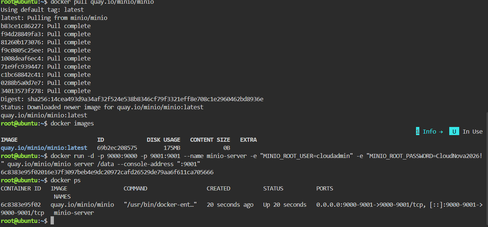
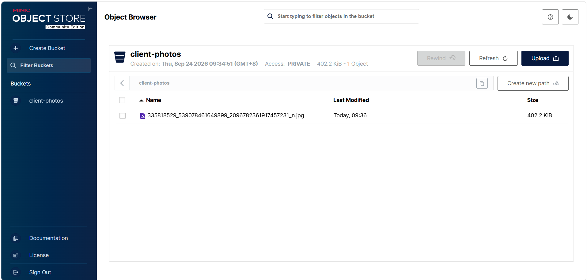

## Docker Command

I deployed the MinIO object storage server using Docker with the following command:

```bash
docker run -d -p 9000:9000 -p 9001:9001 --name minio-server -e "MINIO_ROOT_USER=cloudadmin" -e "MINIO_ROOT_PASSWORD=CloudNova2026!" quay.io/minio/minio server /data --console-address ":9001"
```

The Docker image was downloaded before starting the container using:

```bash
docker pull quay.io/minio/minio
```

## Port Used

The MinIO Web Console was accessed through port `9001`.

Port `9000` was used for the MinIO API, while port `9001` was used for the MinIO Web Console.

## Bucket Created

I created a bucket named:

`client-photos`

I then uploaded a sample file to the bucket to verify that the object storage system was working.

## Environment Variables

The `-e` flags were used to configure environment variables inside the MinIO container.

`MINIO_ROOT_USER` set the MinIO administrator username to `cloudadmin`.

`MINIO_ROOT_PASSWORD` set the administrator password used to access the MinIO Web Console.

## Verification

I verified that the MinIO container was running using:

```bash
docker ps
```

The running container was named `minio-server`, with ports `9000` and `9001` mapped to the host.

## Screenshots

### MinIO Deployment



### Bucket and Uploaded File



